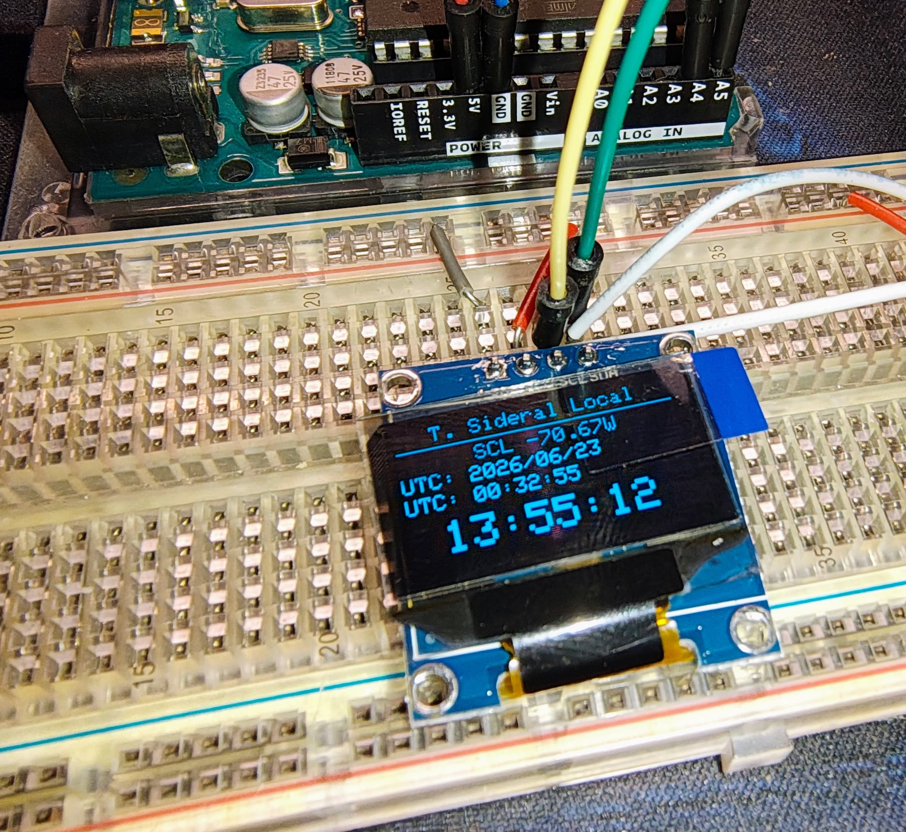

# ArduSideralTime

Small project to calculate and show Local Sidereal Time (LST) on a small OLED display using Arduino.



## Description
This project utilizes a Real-Time Clock (RTC) and an OLED display to show the current UTC time and the corresponding Local Sidereal Time. By default, it is configured for Santiago, Chile. The LST is calculated mathematically based on the Julian Date and the user's longitude.

## Hardware Requirements
- Any standard Arduino-compatible board (Uno, Nano, etc.)
- SSD1306 OLED Display (128x64 resolution, I2C interface)
- DS3231 RTC Module (Real-Time Clock, I2C interface)

## Software Dependencies
You will need to install the following libraries via the Arduino Library Manager:
- `Adafruit GFX Library`
- `Adafruit SSD1306`
- `RTClib` (by Adafruit)

## Configuration
Before uploading the sketch, you can modify the following constants in `src/sideraltime_script/sideraltime_script.ino` to match your location:

```cpp
const float LONGITUD_SANTIAGO = -70.6693; // Your local longitude in decimal degrees (West is negative)
const int OFFSET_UTC = 4;                 // Your local time offset from UTC (in hours)
const int CORRECCION_SEG = 0;             // Fine-tune seconds if needed
```

## Directory Structure
- `src/`: Contains the main Arduino sketch (`.ino`).
- `images/`: Project images and diagrams.
- `scripts/`: Directory reserved for future auxiliary scripts (e.g., Python, Bash).
