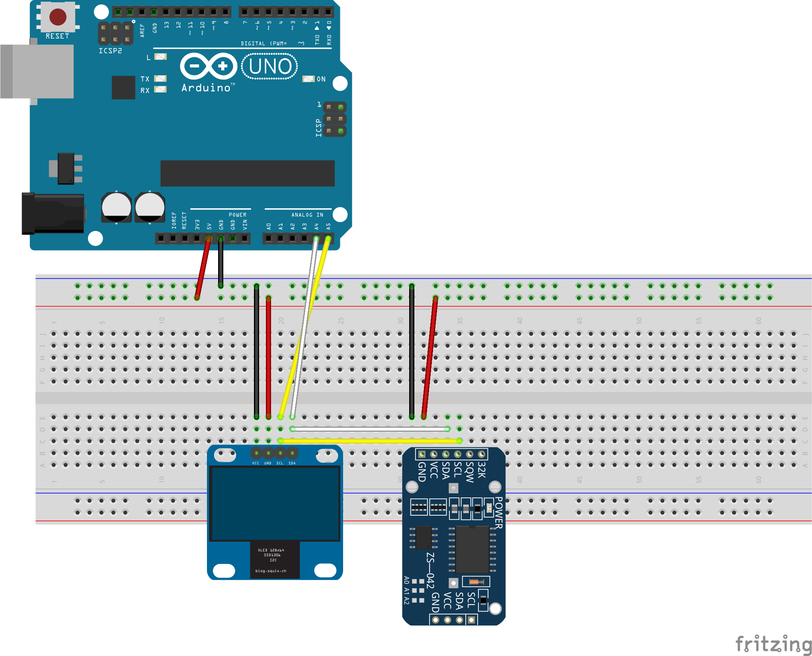

# ArduSideralTime

Small project to calculate and show Local Sidereal Time (LST) on a small OLED display using Arduino.




## Description
This project utilizes a GPS module, a Real-Time Clock (RTC), and an OLED display to show the current UTC time and the corresponding Local Sidereal Time. The GPS synchronizes the RTC automatically with UTC time and provides real-time longitude for accurate LST calculations. The LST is calculated mathematically based on the Julian Date and the user's longitude. By default, it is configured for Santiago, Chile.

## Hardware Requirements
- Any standard Arduino-compatible board (Uno, Nano, etc.)
- SSD1306 OLED Display (128x64 resolution, I2C interface)
- DS3231 RTC Module (Real-Time Clock, I2C interface)
- NEO-M8N GPS Module (or compatible)

## Software Dependencies
You will need to install the following libraries via the Arduino Library Manager:
- `Adafruit GFX Library`
- `Adafruit SSD1306`
- `RTClib` (by Adafruit)
- `TinyGPS++` (by Mikal Hart)

## GPS Wiring Note
The GPS communicates through the Arduino's **hardware UART** (pins 0/1), not `SoftwareSerial`. This frees up enough RAM for the OLED display's buffer to allocate reliably.

**Wiring:**
- GPS TX → Arduino pin 0 (RX0)
- GPS RX → Leave unconnected (no commands are sent to the GPS)

**Important:** Pins 0/1 are shared with the USB programmer. You must **disconnect the GPS TX wire from pin 0 before uploading the sketch**, then reconnect it afterward. Leaving it connected during upload may cause the upload to fail or get corrupted.

**Recommended upload sequence:**
1. Disconnect GPS TX from pin 0
2. Upload the sketch
3. Reconnect GPS TX to pin 0
4. Power-cycle or reset the board (don't just watch — actually cycle power)
5. Check Serial Monitor and the display

## Configuration
Before uploading the sketch, you can modify the following constants in `src/sideraltime_script/sideraltime_script.ino`:

```cpp
const float LONGITUD_SANTIAGO = -70.6693; // Fallback longitude if GPS has no fix (West is negative)
const int   CORRECCION_SEG    = 0;        // Fine-tune seconds if needed
```

> **Note:** The longitude is only used as a fallback when the GPS has no fix. When the GPS has a valid fix, the sketch uses the GPS-provided longitude automatically.

## Directory Structure
- `src/`: Contains the main Arduino sketch (`.ino`).
- `fritzing/`: Circuit schematic and breadboard diagram (Fritzing files).
- `images/`: Project images and diagrams.
- `scripts/`: Directory reserved for future auxiliary scripts (e.g., Python, Bash).
